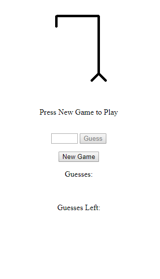
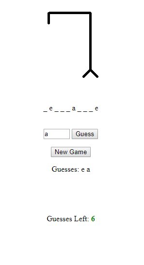
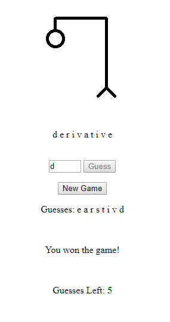
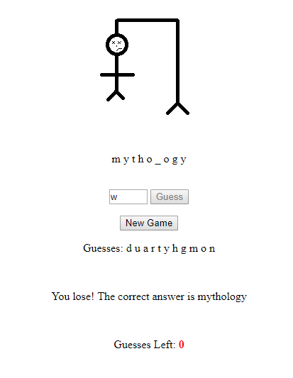

# HangmanGame
This simple game of Hangman demonstrates the use of the basic concepts of HTML and JavaScript.

## Pre-requisites and Requirements
- Web Browser
- Setup: double click `hangman.html`

## Screenshots

## Game Instructions
- Click "New Game" to begin.
- In the box, type in any letter to make a guess.
- Make as many guesses as you can until you win or run out of guesses (and lose).
- You win if you guess the word correctly.

## License
Apache License  
Version 2.0, January 2004  
http://www.apache.org/licenses/  
A permissive license whose main conditions require preservation of copyright and license notices. Contributors provide an express grant of patent rights. Licensed works, modifications, and larger works may be distributed under different terms and without source code.
